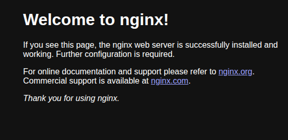

Comencemos con los dockers:
Los dockers son plataformas de codigos abiertos los cuales ayudaran con la creación, despliegue y la ejecución de aplicaciones a base de contenedores.

Si una máquina virtual (VM) es un apartamento completo (con su propio sistema operativo), un contenedor Docker es un camarote de un crucero: usa los recursos comunes del barco (el sistema operativo del host), pero es totalmente aislado y contiene todo lo necesario para esa estancia específica.

Comencemos con las caracteristicas principales de los dockers o para que serian de gran utilidad:
- Aislamiento : No interfiere con procesos externos, como el sistema operativo o otros contenedores.
- Portabilidad : Los contenedores son ligeros y pueden moverse fácilmente entre diferentes hosts y sistemas operativos (Windows, Linux, Mac).
- Inmutabilidad : Las imágenes de Docker se construyen a partir de un Dockerfile y son inmutables (no cambian). Las modificaciones se realizan creando una nueva imagen.

Conceptos a practicar: 
- DockerFile : Un archivo de texto con instrucciones para generar una imagen en Docker
- La Imagen : Una plantilla de una lectura donde se puedan ver todas las capas para ejecutar una apliación
- Contenedor : Es una instancia en ejecución de una Imagen de Docker. Es donde el software cobra vida. Puedes iniciar, detener, mover y eliminar contenedores.
- Proxy Inverso : Es un servidor que se sitúa entre los clientes e internet, actuando como un intermediario que recibe todas las solicitudes de los clientes antes de redirigirlas a los servidores web correspondientes. Esto proporciona beneficios como la mejora de la seguridad, el aumento del rendimiento, la escalabilidad y la optimización del tráfico.

Ejemplo de comando en Ngix donde se ejecutara un contenedor en el puerto 8000
# docker run -d -p 8000:80 nginx

docker run : Le dice a Docker que tome una imagen y cree un Contenedor a partir de ella para ejecutarla.

-d : Modo de ejecución: Ejecuta el contenedor en segundo plano (detached mode). Esto significa que el contenedor se inicia, pero libera tu terminal para que puedas seguir usándola.

-p 8000:80 : Mapea un puerto de tu máquina anfitriona (Ubuntu) a un puerto dentro del contenedor.

nginx: Le indica a Docker que descargue y use la imagen oficial del servidor web Nginx (por defecto, usa la etiqueta latest).

Pero, para que sirve este comando exactamente? 
- Tiene un propósito muy específico: ejecutar un servidor web Nginx de forma instantánea y aislada.

El comando inicia un Contenedor que ejecuta el servidor web Nginx. Este servidor web es una herramienta muy popular para servir contenido estático (HTML, CSS, imágenes) y actuar como un proxy inverso.

1. Servidor Listo en Segundos
Lo que hace es encapsular y ejecutar toda la configuración necesaria para que Nginx funcione. 

Sin Docker, instalar y configurar Nginx en tu sistema operativo Ubuntu requeriría varios comandos, descargas de dependencias y configuración manual.
Con Docker: El comando hace todo eso por ti en un solo paso, utilizando la imagen preconfigurada de Nginx.

# 1. Primero verficamos que el puerto 8000 no se este utilizando:
sudo ss -tuln

Pasos para poder Instalar con docker:
# 2. Actualiza paquetes e instala dependencias
sudo apt update
sudo apt install ca-certificates curl gnupg

# 3. Agrega la clave GPG y el repositorio oficial de Docker
sudo install -m 0755 -d /etc/apt/keyrings
curl -fsSL https://download.docker.com/linux/ubuntu/gpg | sudo gpg --dearmor -o /etc/apt/keyrings/docker.gpg
sudo chmod a+r /etc/apt/keyrings/docker.gpg
echo "deb [arch=$(dpkg --print-architecture) signed-by=/etc/apt/keyrings/docker.gpg] https://download.docker.com/linux/ubuntu $(. /etc/os-release && echo "$VERSION_CODENAME") stable" | sudo tee /etc/apt/sources.list.d/docker.list > /dev/null

# 4. Instala Docker Engine
sudo apt update
sudo apt install docker-ce docker-ce-cli containerd.io docker-buildx-plugin docker-compose-plugin

# 5. Ejecuta Nginx en segundo plano (-d) y mapea el puerto 8000 de Ubuntu al puerto 80 de Nginx
sudo docker run -d -p 8000:80 nginx

# 6. Verificamos que el docker funcione correctamente
sudo docker ps

# 7. Veriicamos en el navegador
http://localhost:8000

Ahora comenzaremos con la limpieza de este docker para futuros proyectos:
# 1. Detener el Contenedor (Stop)
El comando docker stop envía una señal de terminación elegante (SIGTERM) al proceso del servidor Nginx.

# tuve problemas con los permisos y tuve que aplicarlos desde otro terminal
sudo usermod -aG docker hinton1

# Usaremos el ID corto 
docker stop 90688dec14d8

sudo docker rm 90688dec14d8

#Crear un docker file